# CZĘŚĆ OBOWIĄZKOWA

## Krok 1

### **Algorytm**

Aplikacja obliczająca wartość n-tego elementu Ciągu Fibonacciego została zaimplementowana z wykorzystaniem JavaScript'u (NodeJS + Express). Po uruchomieniu kontenera działa w przeglądarce na *localhost:3000*.
Algorytm obliczający wartość wskazanego elementu wykorzystuje pętlę *for*, która wykonuje się do momentu obliczenia wartości elementu o podanym indeksie. Pierwsze dwa elementy (o indeksie 0 oraz 1) są zadeklarowane w funkcji ``getNumFromFibonacciSequence(position)``, natomiast kolejne obliczane są w pętli. Aplikacja posiada zabezpieczenie, które pozwala uniknąć jej zawieszenia się z powodu podania przez użytkownika zbyt dużego indeksu - mianowicie oblicza ona wartości Ciągu Fibonacciego jedynie do 20 indeksu.

___

W celu utworzenia repozytorium git'a wykorzystano następujące polecenia:

```
git init -b main

git add .
git commit -m "Initial commit"
```

Następnie utworzono publiczne repozytorium na platformie GitHub i skopiowano tam zainicjalizowane repo. W tym celu skorzystano z polecenia:

```
gh repo create FibCalc --public --source=. --remote=FibCalc --push
```

Poniższy zrzut ekranu przedstawia stworzone z wykorzystaniem powyższych poleceń repozytorium na GitHubie (*zrzut ekranu wykonany został na późniejszym etapie, podczas tworzenia sprawozdania w postaci pliku README, zatem nie przedstawia "świeżo stworzonego" repo*).

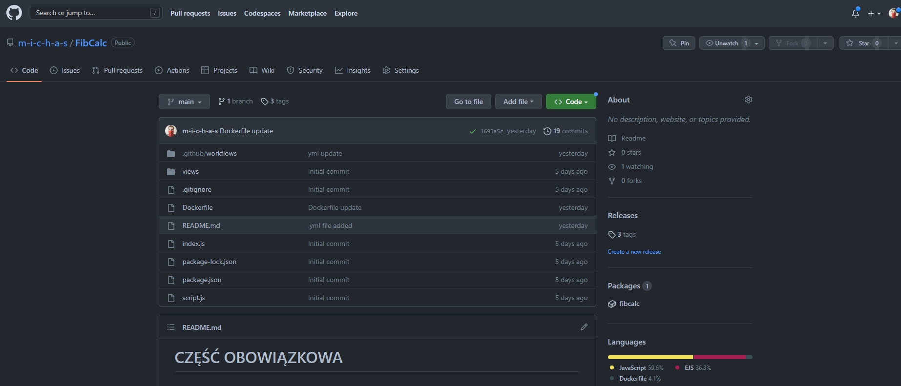

___

## Krok 2


### **A:**

Treść pliku Dockerfile:

```Dockerfile
FROM node:alpine

WORKDIR '/'

COPY package.json .

RUN npm install

COPY . .

EXPOSE 3000

CMD ["npm","start"]
```

___

### **B:**

Zbudowanie obrazu:

```
docker build -t fib_calc:v1 .
```

___

### **C:**

Uruchomienie kontenera:

```
docker run -d -p 3000:3000 --name FibCalc fib_calc:v1
```

\
Działająca aplikacja:

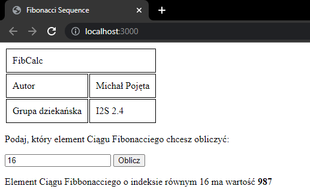

___

## Krok 3


Treść pliku fib.yml:

```yml
name: FibCalc_workflow

on:
  push:
    branches:
      - 'main'
    tags:
      - 'v*'

jobs:
  build-push-images:
    name: Build and push images to repo
    runs-on: ubuntu-20.04

    steps:
      - name: Checkout
        uses: actions/checkout@v3

      - name: Buildx set-up
        uses: docker/setup-buildx-action@v2
        id: buildx

      - name: Docker Setup QEMU
        uses: docker/setup-qemu-action@v2

      - name: Login to DockerHub
        uses: docker/login-action@v2
        with:
          username: ${{secrets.DOCKER_HUB_USERNAME}}
          password: ${{secrets.DOCKER_HUB_ACCESS_TOKEN}}

      - name: Login to gh container registry
        uses: docker/login-action@v2
        with:
          username: ${{ github.actor }}
          password: ${{ secrets.GITHUB_TOKEN }}
          registry: ghcr.io

      - name: Docker meta
        uses: docker/metadata-action@v4
        id: meta
        with:
          images: |
            michas12/zadanie_1
            ghcr.io/${{ github.repository }}
          tags: |
            type=ref,event=branch
            type=ref,event=pr
            type=semver,pattern={{version}}
            type=semver,pattern={{major}}.{{minor}}

      - name: Build and push
        uses: docker/build-push-action@v3
        with:
          cache-from: type=registry,ref=docker.io/michas12/zadanie_1:cache
          cache-to: type=registry,ref=docker.io/michas12/zadanie_1:cache,mode=max
          platforms: linux/amd64,linux/arm64
          context: .
          push: true
          tags: ${{ steps.meta.outputs.tags }}
          labels: ${{ steps.meta.outputs.labels }}
```

___

### **Metoda nazewnictwa:**

Obrazy są nazywane zgodne z metodą *semver*, a zatem ich wersje są zapisywane w postaci *MAJOR.MINOR.PATCH*, gdzie:

* *MAJOR* oznacza zmianę niekompatybilną z API,
* *MINOR* oznacza dodanie nowej funkcjonalności, kompatybilnej z poprzednimi wersjami,
* *PATCH* oznacza naprawienie błędu bez zerwania kompatybilności z poprzednimi wersjami.


Aby przesłać nową wersję do repo, należy stworzyć z wykorzystaniem Git'a nowy tag, który będzie miał odpowiednią nazwę, zgodną ze wzorem *vMAJOR.MINOR.PATCH* (np. *v1.1.0*). Tylko odpowiednio nazwane tagi spowodują stworzenie nowej wersji.

Tag można stworzyć z wykorzystaniem polecenia:

```
git tag <nazwa_tagu>
```

Następnie stworzony tag należy wypchnąć do repo, używając np. polecenia:

```
git push --tags
```

Po wykonaniu tych działań, w repo *ghcr.io* pojawi się nowa wersja. Poniższy zrzut ekranu przedstawia widoczne repo *ghcr.io* po stworzeniu kilku wersji:

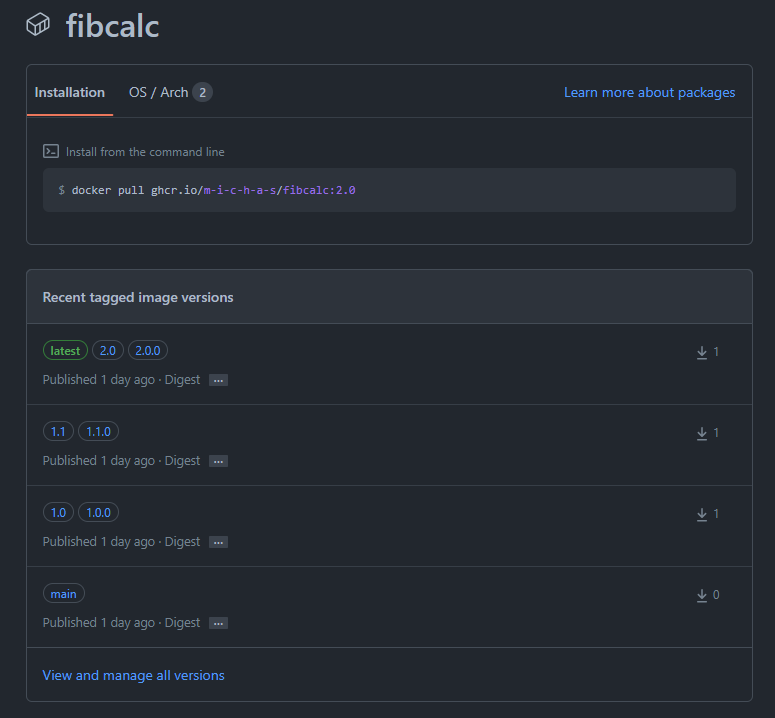

Repozytorium na DockerHubie, gdzie także można zobaczyć obraz z różnymi tagami (wersjami):

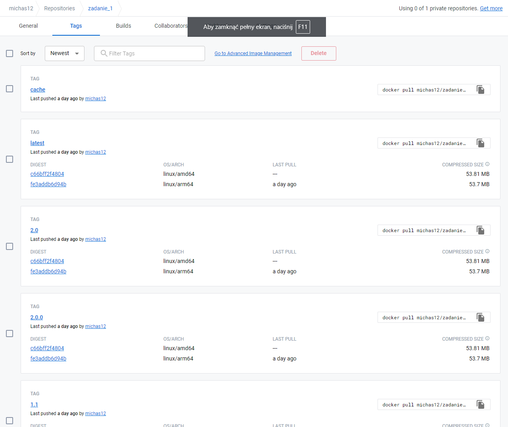

___

### **Zasady wykorzystania repo ghcr.io w pliku fib.yml:**

W pliku *fib.yml* za wykorzystanie repo *ghcr.io* odpowiadają następujące kroki:

* *Login to gh container registry* - odpowiada za zalogowanie do ghcr i używa login-action (należy podać w nim następujące parametry: nazwę użytkownika, hasło i nazwę rejestru),

* *Docker meta* - odpowiada za zdefiniowanie obrazu i jego nazwy, wykorzystuje metadata-action. Nazwa obrazu jest tworzona w oparciu o nazwę repo na GitHubie.

___

## Krok 4

### **A:**

W celu sprawdzenia obecności pliku fib.yml jako opisu workflow skorzystano z polecenia:

```
gh workflow list
```

Poniżej widoczny jest efekt działania tego polecenia:

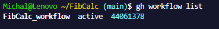

Aby zobaczyć wykonania danego workflow'a można skorzystać z polecenia:

```
gh workflow view
```

Wynik tego polecenia widoczny jest poniżej. Wyświetlany jest commit, nazwa workflow'a, tag, wykonana operacja (push) oraz identyfikator wykonania danego workflow'a.

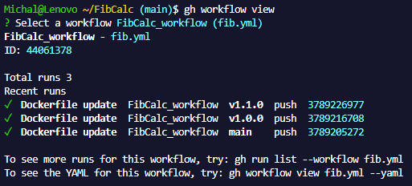

___

### **B:**

Plik fib.yml jest skonfigurowany w ten sposób, że workflow uruchamia się podczas wykonywania operacji *push*. Aby w łatwy sposób zobrazować jego poprawne działanie został utworzony nowy tag (v2.0.0). W tym celu skorzystano z polecenia:

```
git tag v2.0.0
```

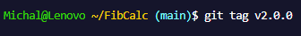

Następnie wypchnięto tag do repozytorium, co spowodowało uruchomienie workflow'a. W tym celu skorzystano z polecenia:

```
git push --tags
```

Poniższy zrzut ekranu potwierdza wykonanie operacji *push*:

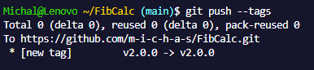

Następnie możemy zweryfikować poprawne wykonanie workflow'a za pomocą polecenia ``gh workflow view``. Po jego wywołaniu widoczne jest nowe wykonanie dla tagu v2.0.0 (wyżej przedstawiono już wynik działania tego polecenia - były widoczne 3 wykonania, teraz pojawia się 4):

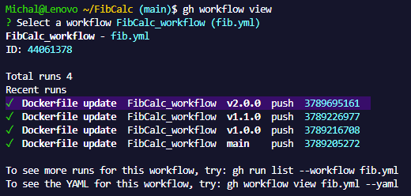

___

### **C:**

Stworzony obraz aplikacji można pobrać z *ghcr.io*. Dla zaprezentowania działania zostanie pobrana wersja 2.0. W tym celu należy skorzystać z polecenia:

```
docker pull ghcr.io/m-i-c-h-a-s/fibcalc:2.0
```

Poniższy zrzut ekranu prezentuje proces pobrania obrazu oraz potwierdza, że jest dostępny lokalnie (polecenie ``docker images``):

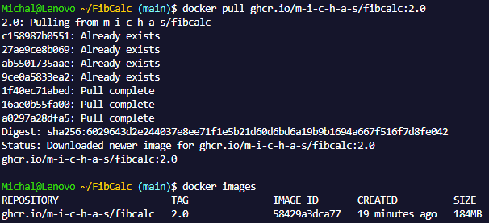

W celu uruchomienia kontenera w oparciu o pobrany obraz należy skorzystać z polecenia:

```
docker run -d -p 3000:3000 --name FibCalcTest_4C ghcr.io/m-i-c-h-a-s/fibcalc:2.0
```

Poniższy zrzut ekranu przedstawia uruchomienie kontenera w oparciu o pobrany obraz, a także potwierdza jego działanie:

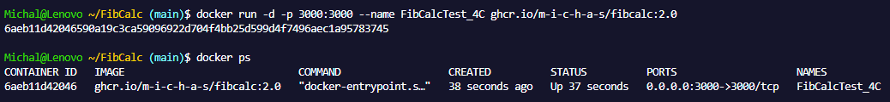

___

### **Potwierdzenie działania cache oraz automatycznego generowania nazw obrazów:**

Jak można zauważyć na poniższym zrzucie ekranu, przy kolejnych wykonaniach workflow'a, w kroku *Build and push* wykorzystywany jest cache. Parametr cache-from określa skąd zaciągany jest cache.

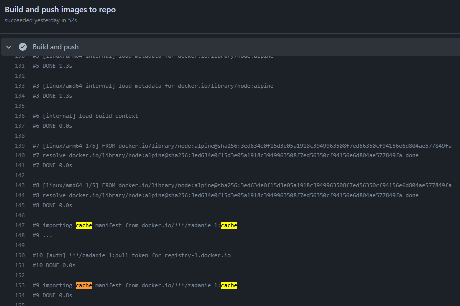


Nazwy obrazów są generowane w kroku *Docker meta* na podstawie nazw wypchanych do repo tagów:

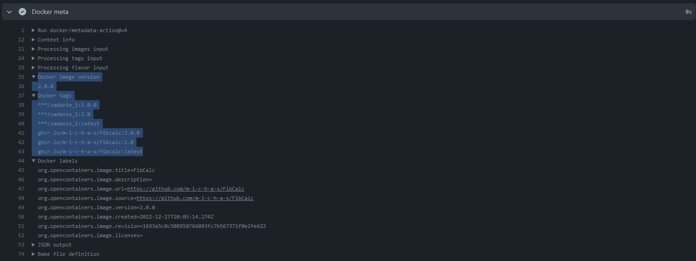

___
### **Linki:**

* **GHCR:** [https://github.com/m-i-c-h-a-s/FibCalc/pkgs/container/fibcalc](https://github.com/m-i-c-h-a-s/FibCalc/pkgs/container/fibcalc)

* **DockerHub:** [https://hub.docker.com/r/michas12/zadanie_1](https://hub.docker.com/r/michas12/zadanie_1)
___

